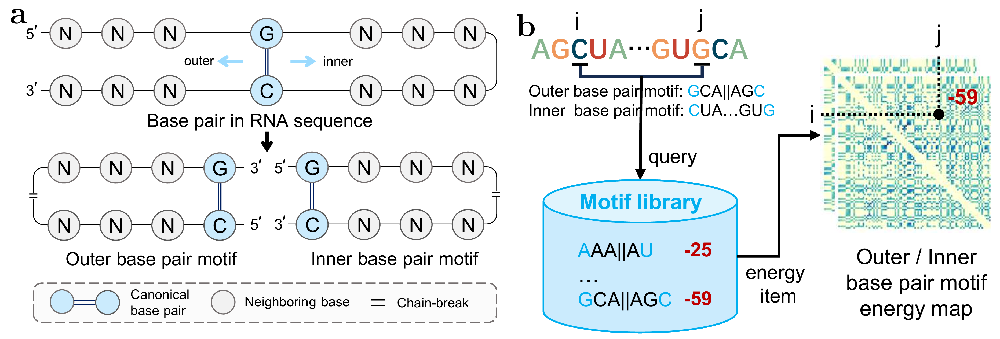
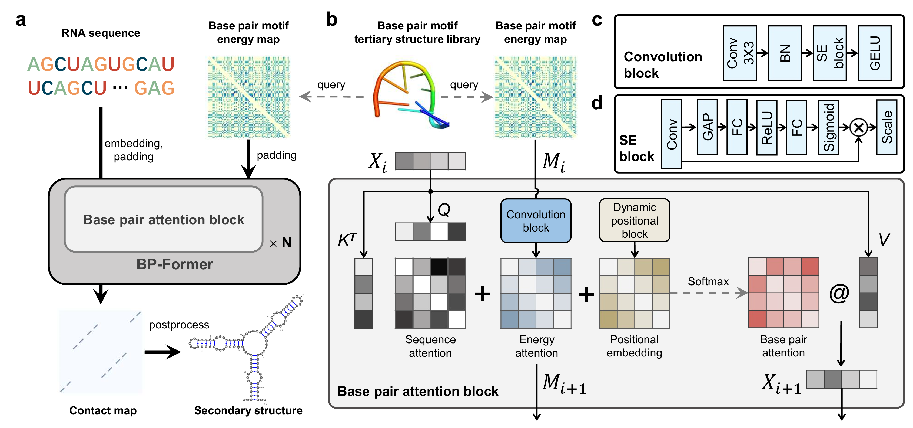

<p align="center">

  <h1 align="center">Deep generalizable prediction of RNA secondary structure via base pair motif energy</h1>
  <p align="center">
    <a href="https://heqin-zhu.github.io/"><strong>Heqin Zhu</strong></a>
    ·
    <a href="https://fenghetan9.github.io/"><strong>Fenghe Tang</strong></a>
    ·
    <a href="https://scholar.google.com/citations?user=mlTXS0YAAAAJ"><strong>Quan Quan</strong></a>
    ·
    <a href="https://bme.ustc.edu.cn/2023/0918/c28132a612449/page.htm"><strong>Ke Chen</strong></a>
    ·
    <a href="https://bme.ustc.edu.cn/2023/0322/c28131a596069/page.htm"><strong>Peng Xiong</strong></a>
    ·
    <a href="https://scholar.google.com/citations?user=8eNm2GMAAAAJ"><strong>S. Kevin Zhou</strong></a>
  </p>
  <h2 align="center">Submitted</h2>
  <div align="center">
    
  </div>
  <p align="center">
    <a href="TODO">bioRxiv</a> | 
    <a href="https://github.com/heqin-zhu/BPfold">code</a>
  </p>
</p>


## Introduction

RNA secondary structure plays essential roles in modeling RNA tertiary structure and further exploring the function of non-coding RNAs. Computational methods, especially deep learning methods, have demonstrated great potential and performance for RNA secondary structure prediction. However, the generalizability of deep learning models is a common unsolved issue in the situation of unseen out-of-distribution cases, which hinders the further improvement of accuracy and robustness of deep learning methods. Here we construct a base pair motif library which enumerates the complete space of locally adjacent three-neighbor base pair and records the thermodynamic energy of corresponding base pair motifs through de novo modeling of tertiary structures, and we further develop a deep learning approach for RNA secondary structure prediction, named BPfold, which employs hybrid transformer and convolutional neural network architecture and an elaborately designed base pair attention block to jointly learn representative features and relationship between RNA sequence and the energy map of base pair motif generated from the above motif library. Quantitative and qualitative experiments on sequence-wise datasets and family-wise datasets have demonstrated the great superiority of BPfold compared to other state-of-the-art approaches in both accuracy and generalizability. The significant performance of BPfold will greatly boost the development of deep learning methods for predicting RNA secondary structure and the further discovery of RNA structures and functionalities.


## Installation
```shell
conda env create -f BPfold_environment.yaml
```

## Usage
### predict
```shell
python3 -m BPfold.predict --input examples/examples.fasta
python3 -m BPfold.predict --seq  UUAUCUCAUCAUGAGCGGUUUCUCUCACAAACCCGCCAACCGAGCCUAAAAGCCACGGUGGUCAGUUCCGCUAAAAGGAAUGAUGUGCCUUUUAUUAGGAAAAAGUGGAACCGCCUG   AGGCAGUGAUGAUGAAAAAAGAUUACCAUCAAACUUUGAGAGAUUCACAGCUCGUUGAUGCAUACUUCUUUAUAUUACCUGAGCCU
python3 -m BPfold.predict --input examples/bpRNA_RFAM_26347.bpseq --output results --save_type ct
```

### evaluate
```shell
python3 -m BPPfold.evaluate --pred_dir .runs/dim256/pred_epoch-296
```

### train
```shell
nohup python3 -m BPPfold.main --run_name .runs/dim256 --batch_size 32 -g 0 --phase train --dim 256 --lr 0.0005 --epoch 150 --nfolds 1 --save_freq 4 --config configs/config.yaml --index_name data_index.yaml --use_BPP > log256 2>&1 &
```

### test
```shell
nohup python3 -m BPPfold.main --run_name .runs/dim256 --batch_size 32 -g 0 --phase test  --dim 256 --ckpt_epoch_list 88 --use_BPP > logtest256 2>&1  &
nohup python3 -m BPPfold.main --run_name .runs/dim256 --batch_size 4 -g 0 --dim 256  --phase test --nfolds 1 --Lmax 1500 --use_BPP > logtest256 2>&1  &
```

## LICENSE
[MIT LICENSE](LICENSE)

## Citation
If you use our code, please kindly consider to cite our paper:

